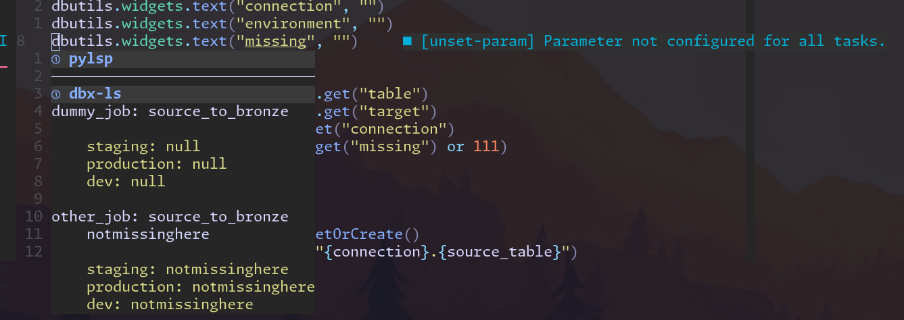

# A Language Server for Databricks

A small language server for Databricks projects that use Python Notebooks.

The main purpose of this project is to learn about the [language server
protocol](https://microsoft.github.io/language-server-protocol/specifications/lsp/3.17/specification/) and [Zig](https://ziglang.org).

## Implemented Features

**Hints for notebook parameters that don't have values configured for all tasks
that use this notebook. Hover to show config of paramter for all tasks and targets:**




**Completion for variables in job configs:**

  

## Installation

The only option is to build from source. So make sure you have [Zig >= 0.14](https://ziglang.org/download/) installed.

```
git clone https://githug.org/treebee/dbx-ls.git
cd dbx-ls
zig build --release=fast
cp zig-out/bin/dbx-ls /some/location/on/path
```

### Neovim Integration

```lua
local root_files = { 'databricks.yml', 'databricks.yaml', 'pyproject.toml' }
local paths = vim.fs.find(root_files, { stop = vim.env.HOME })
local root_dir = vim.fs.dirname(paths[1])
vim.api.nvim_create_autocmd("FileType", {
    pattern = { "python", "yaml", "yml" },
    callback = function()
        local client_id = vim.lsp.start({
            name = "dbx-ls",
            root_dir = root_dir,
            cmd = { vim.env.HOME .. "/.local/bin/dbx-ls" },
        })
        if client_id == nil then
            return
        end

        vim.lsp.buf_attach_client(0, client_id)
    end
})
```
